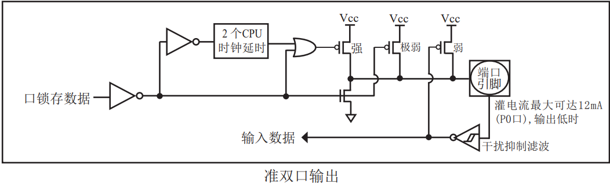
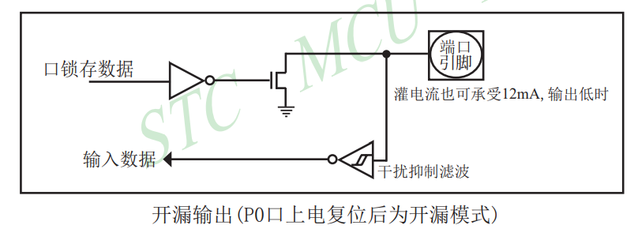

# 基本输入输出

1. 特殊功能寄存器

   1. `sfr`关键字

      `sfr`关键字会声明一个指定地址的寄存器
      eg:

      ```C
      sfr P2 = 0xa0;
      ```

      该语句作用为声明一个寄存器 `P2`，这个寄存器的地址为 `0xa0`。注意声明时，等号后是他的地址。
      之后对其赋值时，例如，如下语句：

      ```c
      P2 = 0xf0;
      ```

      等号后为一个数，不再是地址。该语句作用为对 `P2`这个寄存器赋值为0xf0。
   2. `sbit`关键字

      `sbit`关键字创建一个指定寄存器的指定二进制位。

      eg：

      ```
      sbit led = P2 ^ 6;
      ```

      该语句作用为声明一个二进制位 `P2`，这个东西是 `P2`的第6位，当 `led = 1`时，P2的第6位就会置1。
2. 端口硬件结构
   对于**89C51/52**单片机，P1，P2，P3，P4是准双向/弱上拉，如图。

   

   P0口是开漏输出，如图。

   

   所以P0口用于IO输出的时候要加上拉电阻。
3. 输出
   对特殊功能寄存器或特殊功能寄存器的位进行赋值，即为输出操作。

   eg：

   1. 点亮一个LED(低电平点亮)

      ```c
      sfr P2 = 0xa0;

      sbit led = P2 ^ 0;

      int main()
      {
          led = 0;
          while(1)
              ;
      }
      ```
   2. 跑马灯

      ```c
      sfr P2 = 0xa0;

      #define ledPort P2

      int main()
      {
          ledPort = 0xfe;
          while (1)
          {
              delayMs(1000);
              ledPort <<= 1;
              ledPort |= 0x01;
              if (ledPort == 0xff)
                  ledPort = 0xfe;
          }
      }
      ```
   3. LED翻转

      ```c
      sfr P2 = 0xa0;

      sbit led1 = P2 ^ 0;

      void led1Flip(void)
      {
          led1 = !led1;
      }
      ```
4. 输入
   将特殊功能寄存器或特殊功能寄存器的位的值赋给其他变量，或对其进行读取，即为输出操作。

   eg:

   1. 按下后亮灯
      ```c
      sfr P2 = 0xa0;
      sfr P3 = 0xb0;

      sbit led1 = P2 ^ 0;
      sbit key1 = P3 ^ 1;

      int main()
      {
          while(1)
              led = key1;
      }
      ```
   2. 按下后灯翻转
      ```c
      sfr P2 = 0xa0;
      sfr P3 = 0xb0;

      sbit led1 = P2 ^ 0;
      sbit led8 = P2 ^ 7;
      sbit key1 = P3 ^ 1;

      int main()
      {
          while (1)
          {
              // 按下key1，led1翻转一次，led8常亮，
              // 不按key1时led8长灭
              if (!key1) // 如果按下
              {
                  delayMs(4);
                  if (!key1) // 如果真的按了
                  {
                      led8 = 0;
                      led1 = !led1;
                      while (!key1) // 等松手
                          ;
                      led8 = 1;
                  }
          }
      }
      ```
   3. 双击后灯翻转
      ```c
      sfr P2 = 0xa0;
      sfr P3 = 0xb0;

      sbit led2 = P2 ^ 1;
      sbit led8 = P2 ^ 7;
      sbit key1 = P3 ^ 1;

      int main()
      {
          uint8_t maxWait;
          led1 = led2 = 1;
          led8 = 1;
          while (1)
          {
              // 按下key1，led8常亮，
              // key1双击，led2翻转一次
              // 不按key1时led8长灭
              if (!key1) // 如果按下
              {
                  maxWait = 50;
                  delayMs(4);
                  if (!key1) // 如果真的按了
                  {
                      led8 = 0;
                      while (!key1) // 等松手
                          ;
                      led8 = 1;
                  }
                  delayMs(4);
                  while (key1 && maxWait--) // 等按下
                      delayMs(5);
                  if (!key1) // 有双击可能，还要判断毛刺
                  {
                      delayMs(4);
                      if (!key1) // 真的双击了
                      {
                          led8 = 0;
                          led2 = !led2; // 双击操作
                          while (!key1) // 等松手
                              ;
                      }
                  }
                  led8 = 1;
              }
          }
      }
      ```

思考问题
--------
